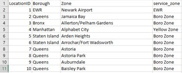
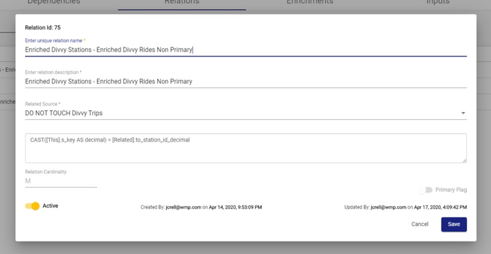

# Relations

Relations allows the user to define a relationship between 2 Sources. Through that Relation, the user has access to all of the attributes of both Sources when configuring Enrichment rules.

## Creating Relations

To create a Relation, select a Source from the Sources screen, select the Relations tab, and click "New Relation" in the top-right corner of the screen.

Relations have a few crucial properties:

* **Relation Name:** __The name of the Relation must be unique because a Relation is simply a relationship between any 2 Sources in the RAP environment, and a unique identifier is needed to distinguish one Relation from another.
* **Related Source:** Specifies the related Source.
* **Relation Expression:**  This is a boolean expression written in SQL that "joins" the current Source \(denoted by "This"\) to the related Source \(denoted by "Related"\). The Relation will return 0, 1, or multiple records depending on the result of the expression.

Consider the Source data below. The first image is the first 10 records of taxi cab ride data, where each record shows the data for separate trips. The second image is the first 10 records of location data, where each record represents a unique location. Let's say that the first image represents "This" Source, and the second image represents the "Related" Source.

If the Relation expression is \[This\].DOLocationID = \[Related\].LocationID, the Relation would return only 1 record since LocationID in the related Source is a Key column with unique values.

* **Primary Flag:** Specifies whether the Relation is a primary Relation. This property is intended for the Relation that will be referenced the most when configuring Enrichment rules since they are much easier to reference. A Source can have only 1 primary Relation.

Click "Save" to finish creating the Relation.

## Using Relations in Enrichment Rules

Through Relations, users can access attributes from another Source when configuring Enrichment rules.  

When configuring the Expression property on the Enrichment configuration screen, the user must use the expression syntax specified below to access attributes properly.  

<table>
  <thead>
    <tr>
      <th style="text-align:left">Expression</th>
      <th style="text-align:left">Description</th>
      <th style="text-align:left">Examples</th>
    </tr>
  </thead>
  <tbody>
    <tr>
      <td style="text-align:left">[<em>Source Name</em>]</td>
      <td style="text-align:left">Source container</td>
      <td style="text-align:left">[Divvy Rides]</td>
    </tr>
    <tr>
      <td style="text-align:left">[This]</td>
      <td style="text-align:left">Current Source container. Equivalent to [<em>current source name</em>]</td>
      <td
      style="text-align:left">[This]</td>
    </tr>
    <tr>
      <td style="text-align:left">[Related]</td>
      <td style="text-align:left">Container for related Source. Only allowed in Relation expression</td>
      <td
      style="text-align:left">[Related]</td>
    </tr>
    <tr>
      <td style="text-align:left">[<em>Relation Name</em>]</td>
      <td style="text-align:left">Non-primary Relation name, indicates path to the Source containers used
        in expression</td>
      <td style="text-align:left">[This]~{To Station Relation}~[Divvy Rides].attribute</td>
    </tr>
    <tr>
      <td style="text-align:left">.</td>
      <td style="text-align:left">Separator of Source containers and attribute names</td>
      <td style="text-align:left"></td>
    </tr>
    <tr>
      <td style="text-align:left">~</td>
      <td style="text-align:left">Path indicator, separates Source containers and Relations</td>
      <td style="text-align:left">[Divvy Rides]~{Relation Z}~[Weather].attribute</td>
    </tr>
    <tr>
      <td style="text-align:left">[<em>Relation</em>].<em>attribute_name</em>
      </td>
      <td style="text-align:left">Attribute in the container</td>
      <td style="text-align:left">
        
[Divvy Rides].trip_id

        
[Divvy Stations].latitude

        
[This]~{To Station Relation}~[Divvy Rides].longitude

      </td>
    </tr>
  </tbody>
</table>