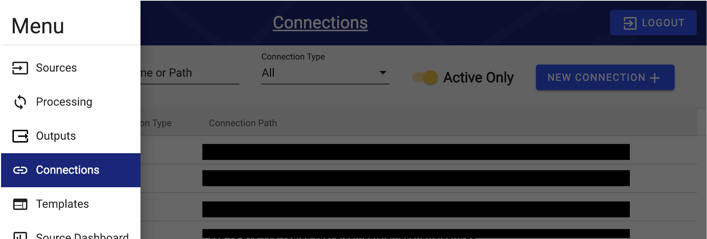
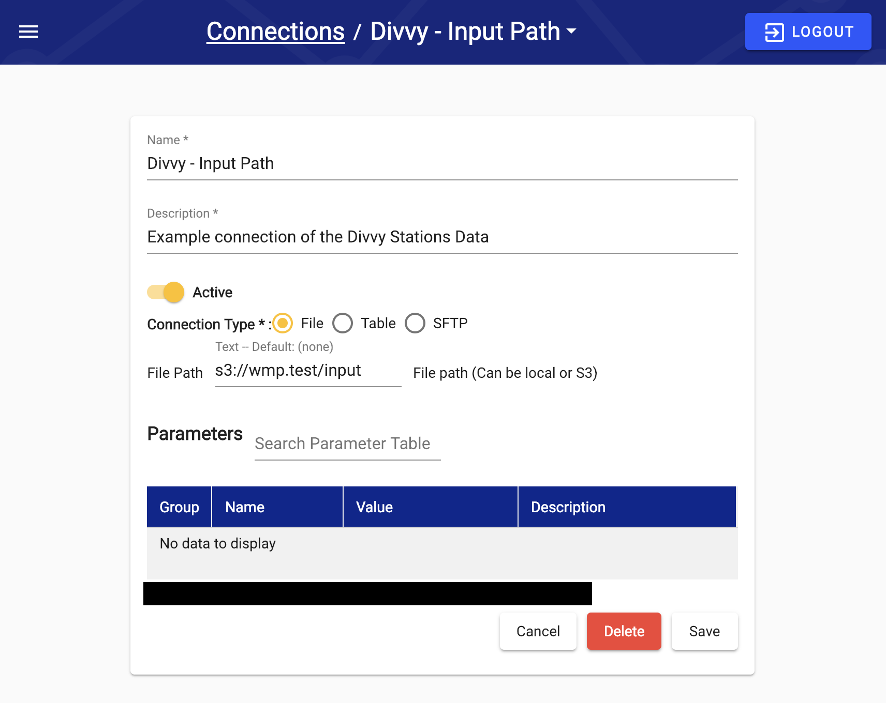
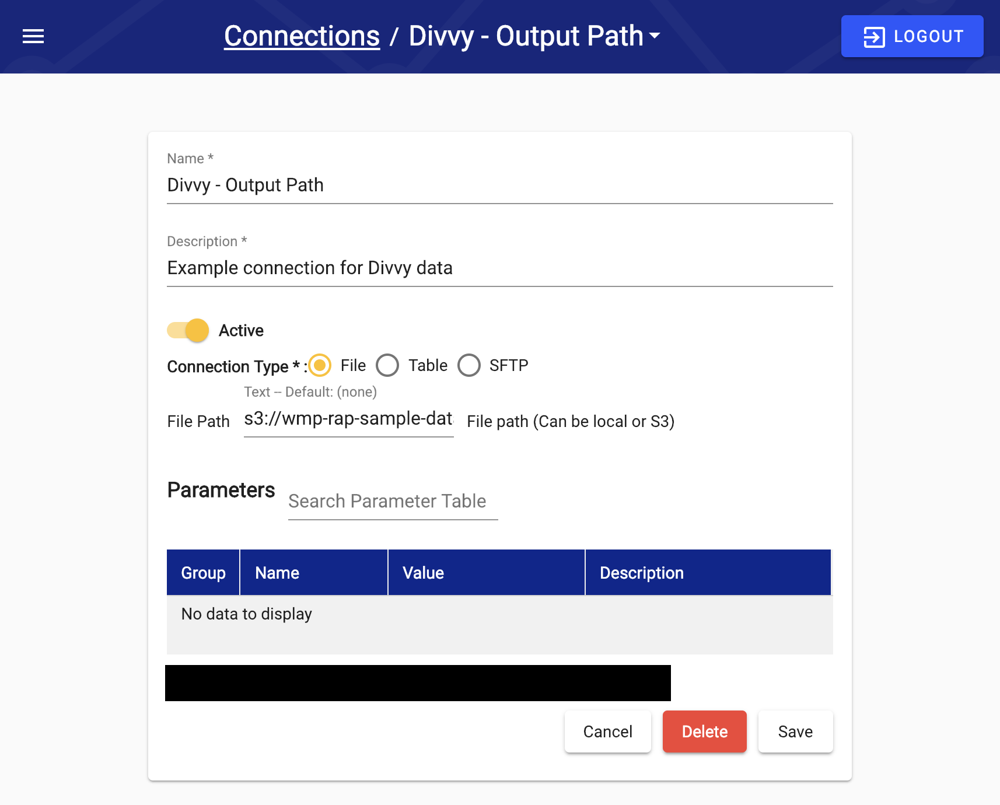

# !! Connection

## Step 1: Create a Connection

RAP communicates to external data services through Connections. Connections consist of configurations for **where** and **what type** of data to pull into RAP. Both Sources and Outputs can use connections. For this example, we will configure one file location to pull data from \(Source\) and another file location to push the data out \(Output\).

### Opening RAP

In a Chrome browser, navigate to the RAP Sources screen by accessing the URL provided by your RAP account team and logging in.

### Making a new Connection

Navigate to the Connections screen through the Menu, as seen below.

On the Connections screen, click New Connection in the top right corner. The image below highlights the correct button.

### Naming your new Connection

The below image shows where to add a unique Name and write a brief Description. When naming a Connection, be sure to follow the [Naming Conventions](connection.md) guide. Use `Divvy - Input Path` for the Source Connection Name.


Connection Names must be unique.



Note that all fields marked with an asterisk \(\*\) are mandatory.


#### Extra Options


The below image _\*\*_shows the Active toggle. This is used to deactivate or reactivate a connection. By default, all connections are active when created. Deactivating a connection removes it from the active sources list, and stops any processes from running on the connection. Once this connection is reactivated, it resumes input/output.


## Step 2: Select Connection Type

The below image shows the Connection Type control. Connection type selection dynamically updates the available options.

Select `File`. This tutorial pushes a file to RAP as input and then outputs a file.

For examples of other connection types, see the below tabs.



**Table** is a connection to an external database.



**SFTP** \(SSH File Transfer Protocol\) is a file protocol used to access files over an encrypted SSH transport.



**File** is used to access files and can be local or in Amazon S3.



For context, if there are additional parameters of interest to change or modify, begin typing into the Parameter "Search Parameter Table" to modify these additional parameters.

## Step 3: Indicate File Path

Finally, file\_path is the path to the location of the file, excluding the filename. Recall that the input data is located in S3, so enter the path to _your designated input container_. All file paths will begin with `s3://` , so an example input path will look like`s3://wmp.test/input`.


After configuring the **Source** connection, be sure the input file is in the correct folder or S3 bucket.


Click **Save** to finish Source Connection configuration. The final configuration should look something like the following.

## Step 4: Create Output Connection

An additional Connection will be required during the [Output](output.md) phase. Repeat the previous steps to configure an Output Connection with the following parameters:

* **Name:** `Divvy - Output Path`
* **Connection Type:** `File`
* **file\_path:** The path to your output container 

Click **Save** to finish Output Connection configuration. When both Source and Output Connections are configured, move onto [Source](source.md).

