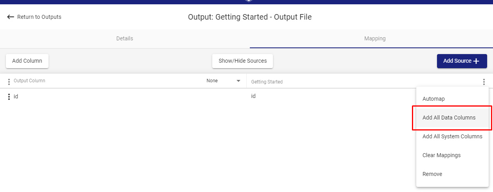
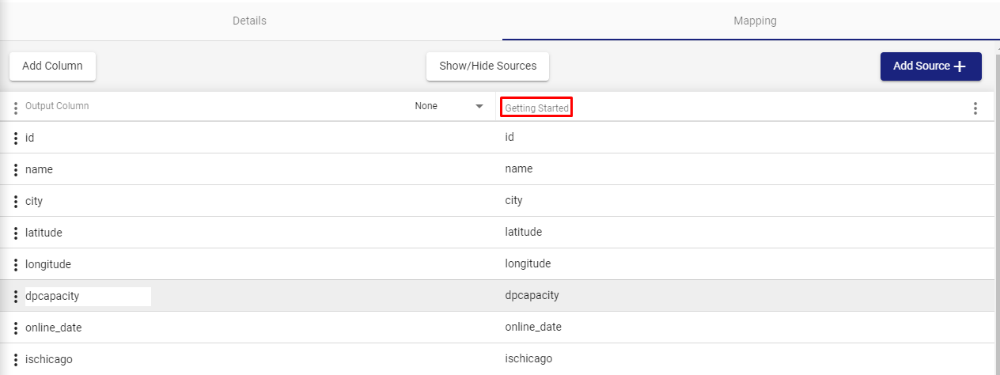
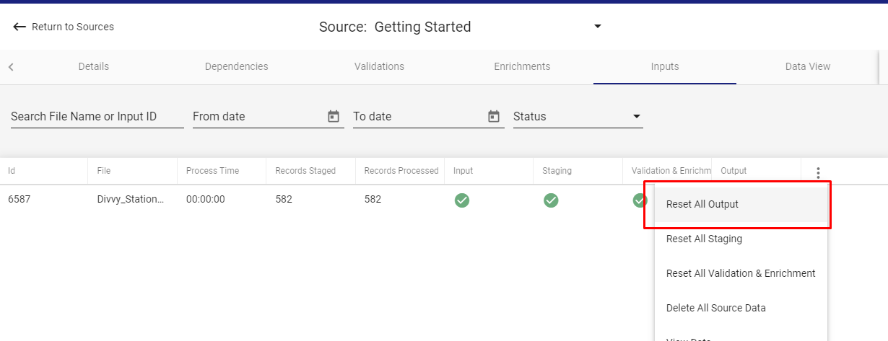

# Output

## Step 1: Create Output Connection

An output connection is necessary in order to complete this phase. If this was not created during the [Connection](connection.md) section earlier, complete this first.

## Step 2: Create Output

### Output Creation

Before configuring any mappings, RAP requires general information about the desired Output, including a name and where within the connection the output should push data. To begin creating an Output, select Outputs in the Navigation Menu, and then select **Create New Output** on the Outputs screen. Following the [Naming Conventions](), use the following values for Output Details configuration:

* **Name:** `Divvy - Chicago Stations`
* **Description:** File output for enriched divvy stations data

### Output Configurations


#### Output Type

RAP offers four output types. For this example we will use `File`.



RAP can output to a **File**, which can be a CSV or Parquet format and optionally compressed with gzip.



RAP can output to, manage, and ensure accurate refresh of a database **Table**.



RAP can send files via **SFTP** connection in a CSV format.



RAP can create a Postgres database view to expose data for polling by outside systems, otherwise known as a **Virtual** table.



#### File Type

Because `File` was selected, this option displays. Select `CSV` to output a simple `.csv` file. For more information on Output File Types, see below:



A plain-text comma-separated file. Common and easy to import, but not suitable for large files or semi-structured data.



Parquet is column-oriented data storage format, useful when direct to file queries are needed, such as use in Apache Hadoop, Apache Spark, or AWS Athena.



### Output Parameters

**connection\_name:** Select the Output Connection configured earlier: `Divvy - Output Path`. For help configuring the Output Connection, see [Connection Configuration](connection.md).

**file\_mask:** Enter `divvy_chicago_only_<TSHH12MISS>.csv`. This is a mask that describes the name of the output, where `<TSHH12MISS>` is replaced by the time the file was generated.

**key\_history, partition,** and **limit\_by\_effective\_range** can be safely left as-is for now. For more detailed information, see the [Output Configuration](../../configuration-guide/outputs/) section in the [Configuration Guide]().

## Step 3: Map Output

With the output details configured, and a location within the connection to push the data established, the next task is to map the individual columns from the RAP data hub to the output file.

### Adding a Source

To enable mappings between the created Divvy Stations source `Divvy - Stations 2017 Q1Q2`and the created Output `Divvy - Chicago Stations` the next step is to add the Source to the Output Mapping screen, thus generating a link between this Source and Output. Click **Add Source** in the top right corner, as seen below.


This should bring up a Source selection pane. Select the Source `Divvy - Stations 2017 Q1Q2` and press **Add Source**.

### Adding Columns

First, add a single column. Click on **Add Column** in the top left corner, seen opposite of **Add Source** in the image above.

On the left, type `id` in the Output Column, and on the right where a "\_\_\_\_\_" shows, click, then select `id` from the Source columns available in the popup. This maps the `id` column in the Source to an identically named column in the Output. The resulting configuration should look like the image below.



Notice that there is no option to configure datatypes. This is because RAP knows the output is into a plain-text `.csv`, so all output is of type text.


Second, add all of the source data columns at once, instead of one by one. Following the image below, click on the ellipses in the top right, and select **Add All Data Columns**. 




Notice that RAP does not configure a duplicate `id` column, as it is able to tell that the user has already configured one.



Note: It is best practice to manually add all Output Columns when configuring an enterprise grade system to adhere to destination naming convention and semantics.


### Filtering Data

Add a filter that ensures the only records in the output have a flag of `ischicago = 'Y'`. This uses the Expression created earlier to filter the Output for only Divvy Stations in Chicago.

Click on the Source header above the Source column names to open up the filter menu, as in the image below.



Enter the following code for the Filter Expression, which makes use of the `ischicago` flag.

```sql
ischicago = 'Y'
```

#### Parameters:

**Include Rows:** `Passed` only. This checks flags created during [Validation](validation-and-enrichment.md#step-1-configure-validation) to determine which data to include in the output. Here, if rows failed validation then RAP would be unable to correctly filter them.

**Operation Type:** `N/A`, this guide does not transform the data in any other way.

**Name:** `Divvy - Chicago Stations 2017 Q1Q2`

**Description:** `only output Chicago stations`


When the configured filter resembles the above image, select **Close** and then **Save** to complete Output Configuration.

## Next Steps

Now that a Source and Output have been fully configured, the final step is to run our file all the way through to our destination output.

### Creating Output File

The output file should appear in the appropriate folder specified during the creation of the output [Connection](connection.md#step-1-create-a-connection).

To ensure the output file is generated, navigate to the Source's Input tab. There, click on the the kebab button \(**⋮**\) on the Stations input and select **Reset All Output**, as seen below.




For all future data files related to this Source, no manual reset steps are required for the data to flow fully through Validation and Enrichment and generate a new file in the Output folder.


### Confirming Successful Output

If configuration was done correctly, the output file should be found in the folder specified by the Connection, and it should contain 518 entries \(519 including the headers\).


