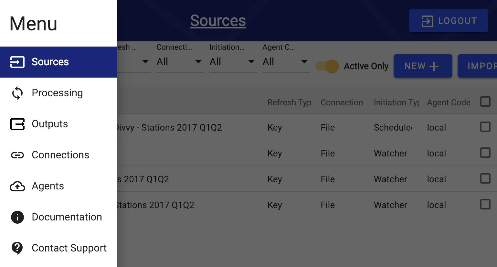
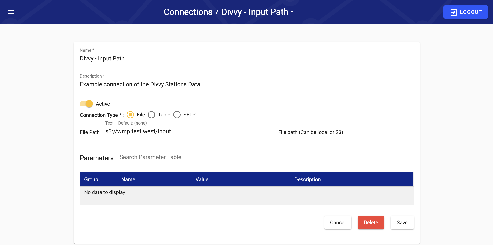

# !!Navigation and Interface

## Navigation Menu

Upon login, users are directed to the Sources screen. The Navigation Menu, located in the top left corner of the screen, enables navigation between RAP screens from any of the currently displayed screens.

## !!Primary Screens 

!!include screenshots of the of the different primary screens in addition to the links!!

### Sources

The [Sources](../../configuring-the-data-integration-process/source-configuration/) Screen controls loading data from external systems into RAP, assesses quality via Validation Rules, and transforms data using Enrichment Rules. Additionally, it contains the Inputs tab to track the progress of individual file processing and enable restart of any failed or mis-configured processing tasks. Lastly, it contains the Data Viewer tab, allowing users to view and query the data for this Source stored within the Data Hub. 

When we think of the logical data flow, we can consider the Source Screen controls to be the manager from raw data ingestion all the way to output. 

### Processing

The Processing screen shows the progress and outcome of all execution tasks through the platform, including sub-processes. Processing can be navigated to by either the left-hand menu and the selection of processes or within a source selecting the processing tab.

### Outputs

The [Outputs](../../configuring-the-data-integration-process/output-configuration/) screen controls loading data from the Data Hub to the Data Warehouse layers. Source-target mapping, logs, and other output details can be viewed here, as well as historical outputs.

### Connections

The [Connections ](../../configuring-the-data-integration-process/connections-configuration.md)screen controls the connections to the External Source Systems and Data Warehouses. Connections can be used for both Sources and Outputs.

## Sources Details - The Logical Data Flow

Sources can be thought of as managing the entire logical data flow. Sources work with connections and other sections of RAP to complete this flow. 

Within Sources there are seven tabs: Settings, Dependencies, Relations, Enrichments, Inputs, Process, and Data View. In depth information of the Sources location is found [here](../../configuring-the-data-integration-process/source-configuration/), what is provided here is an overview of how the Logical Data Flow seen in the [How it Works](how-it-works-2.md#the-data-flow) section is applied to the Sources interface.

### Ingest

The Ingest step moves data into RAP's Data Lake. The settings tab of the source screen requires an input connection. We utilize the **Connections** interface of RAP to specify this input location, and then select this connection where prompted in the Source settings.

!! MC - Similar to comment on How It Works page, probably should line up sections below with 4 storage layers.

### Enrichment

!! MC - Relations is more for defining how to do joins for lookups, think "merging" isn't really the right term to use.  Also, not sure if the Inputs tab should be really referred to in here, feels like that's more used for monitoring / checking run statuses.

Enrichment occurs within the Data Hub and shows up in  several locations of the sources interface. The **Relations** tab allows for rules similar to joins for lookups. The **Enrichments** tab allows for different data manipulations and calculations to occur. Within the Enrichments interface there is also the option for **Validation** which is a useful way to flag or warn the user of possible data issues.  Finally the **Data Viewer** allows for a visual of the data in tabular format.

### Outputs

!! MC - Should refer to the Outputs page as to where this is all set up.

The Output step maps the transformed data from the Data Hub to a Data Warehouse or 3rd party location. Outputs are created and defined in the **Outputs** screens \(found in the left-hand menu\). Outputs utilize Sources and Connections to appropriately move data to the desired location. 

