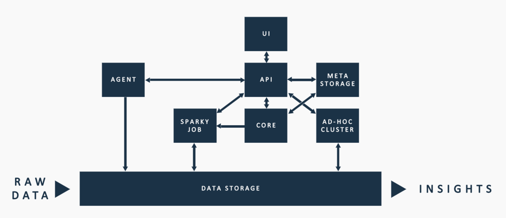

# !! Infrastructure Components

## The Components

RAP leverages various cloud components in AWS or Azure \(depending on the platform selected\). Regardless of the platform, the actions of the components remain the same. This section provides an overview of these different components and how these components interact with one another. Subsequent sections explore the details as they pertain to what specific services are leveraged in the AWS or Azure platform.

### UI \(User Interface\)

The UI represents what you see when you log into the RAP platform. The UI is the front end view of RAP. The [UI](../../logical-architecture-overview/user-interface.md#overview) is characteristic of the left-hand menu and consists of screens including Sources, Connections, Agents, and Outputs. The UI is agnostic to the platform \(AWS or Azure\) as it is interacted with through the browser.

### API

RAP's API is a lightweight communicator between all of the components of the infrastructure. The API strictly communicates between the components and does not execute any business logic.

!! Add image of the physical architecture, what software used, etc.

RAP leverages various cloud components in AWS or Azure \(depending on the platform selected\).  This section provides an overview of the components leveraged by RAP, how they are leverages as part of the RAP processing engine, and how sizing affects processing performance.

This section covers the following components of the RAP infrastructure stack, as well as how sizing affects performance when applicable:

* On-Premise Agent
* Data Lake Storage
* Virtual Machines
* Database Layer

