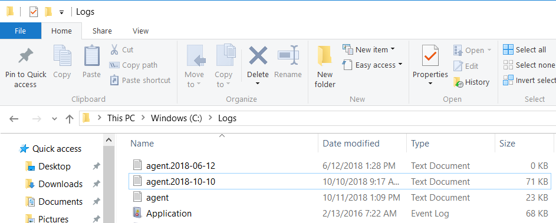
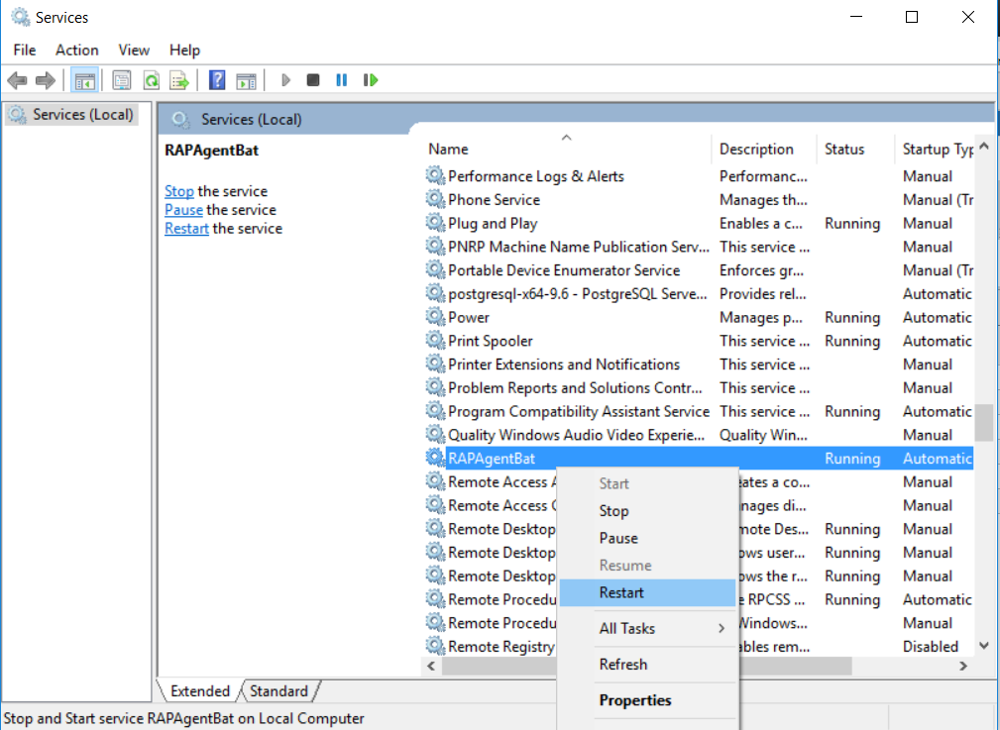

# RAP Agent

The RAP Agent installs on local client machines. Its purpose is to acquire files from local file storage and upload them to the RAP application. Because the RAP Agent is located on third party client machines, it is often more difficult to troubleshoot issues related to its operation. This section details managing the health of the RAP Agent and troubleshooting issues related to the RAP Agent.

## RAP Agent Health

The RAP Agent signals its health and continued operation via a heartbeat to the API. Every time an Agent pings the API the `last_transmission_timestamp` of the ping updates in the Database under the Agent Code that pinged the API. Find this information in the stage.agent table in Postgres.

In this example, the local agent last hit the API at 14:57 UTC on August 30. Every 30 seconds the agent pings, so if the Agent has not pinged for more than 30 seconds, there may be an issue.

## RAP Agent Logs

It is helpful to check the log files of the Agent if the Agent is not responding. The log files are located at `<Drive where Agent is installed>/Logs/agent.log`

The Agent cannot communicate if there are network issues or an inability to hit the RAP API from the Agent’s install location. The Agent cannot run without a Java 8 installation on the on premise machine as well. Refer to the Agent Install Guide for more information involving starting and configuring the RAP Agent.

To start, stop, or restart the Agent service, navigate to the services window, and restart the service named RAPAgentBat.

